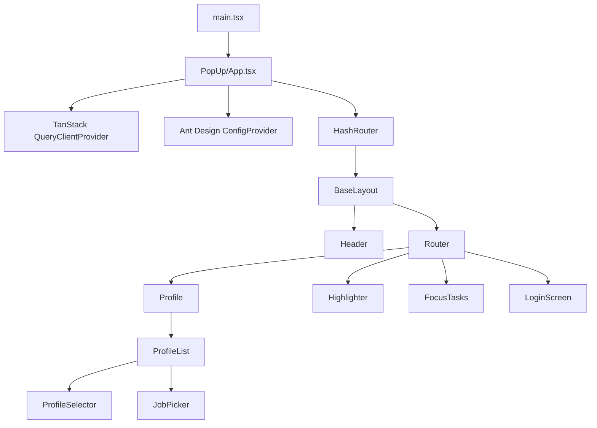

# Navigator Extension Architecture

## System Role

`navigator_extension` is a Manifest V3 Chrome extension. The legacy LinkedIn
scraper, background service worker, and browser-action popup have been removed.
The remaining source is the reusable Talentor popup application, which is being
repurposed for an in-page overlay (iframe) opened by a fixed launcher.

Current runtime:

- **Content script:** `src/modules/injector/index.tsx` runs on every `http(s)`
  page, mounts a shadow-DOM launcher, and opens an extension-origin iframe overlay.
- **Focus content script:** `src/modules/focus/content.ts` runs only on
  `https://www.youtube.com/*` (`document_start`) and applies the Focus tasks
  configuration for the current hostname, independent of the per-site launcher
  toggle.
- **Popup application source:** `index.html -> src/main.tsx -> src/modules/popup/App.tsx`.
  It is loaded by the overlay iframe via `chrome.runtime.getURL('index.html')`.
- **No background service worker.**
- **No `action.default_popup`.**

## Build And Manifest Wiring

```text
manifest.config.ts
└── content_scripts -> src/modules/injector/index.tsx   (http://*/*, https://*/*)
└── content_scripts -> src/modules/focus/content.ts      (https://www.youtube.com/*, document_start)
└── web_accessible_resources -> index.html, assets/*
    └── launcher + overlay iframe (shadow DOM)

index.html
└── src/main.tsx
    └── src/modules/popup/App.tsx      # loaded inside the overlay iframe
```

CRXJS derives manifest HTML entries from `action`, `options_*`, `sandbox`, etc.,
not from `web_accessible_resources`, so `vite.config.ts` adds `index.html` with
`build.rollupOptions.input.overlay` to get it bundled.

## Source Hierarchy

```text
src/
├── main.tsx                    React entry (mounted by index.html in the iframe)
├── lang/                       Shared i18n setup + translations (popup + injector)
│   ├── i18n.ts                 i18next init, imported by both entries
│   └── common/                 Translation JSON files (es_common.json, ...)
└── modules/
    ├── common/                 Cross-module: components/, constants/, hooks/, models/, utils/
    │   ├── components/         Generic ButtonIcon + Switch
    │   ├── hooks/              Shared hooks (useSiteEnabled)
    │   ├── models/             Generic types (CustomizableComponent, IconSize, ...)
    │   └── utils/              Shared helpers (siteAccess: per-site enable/disable)
    ├── toolbar/                Browser-toolbar popup (toolbar.html via manifest action)
    │   ├── main.tsx            Toolbar entry
    │   ├── App.tsx             Current-site hostname + enable/disable toggle
    │   └── toolbar.css         Tailwind entry + toolbar theme vars
    ├── highlighter/            Resaltador: keyword highlighting
    │   ├── constants/          Hardcoded keywords + whole-page defaults
    │   ├── engine/             Patterns, matches, theme, range cache, DOM scan,
    │   │                       `highlightKeywords(keywordLists, cssSelector)`
    │   ├── storage.ts          `highlighter-settings` in chrome.storage.local
    │   ├── selectors.ts        `highlighter-selectors` (hostname -> CSS selector)
    │   ├── start.ts            Coordinator (per-host selector + settings changes)
    │   └── index.ts            Public surface
    ├── injector/               Content script: shadow-DOM launcher + overlay iframe
    │   ├── index.tsx           Content-script entry (manifest js)
    │   ├── App.tsx             Launcher/overlay composition
    │   ├── constants.ts        Extension app URL (adds `?host=<hostname>`)
    │   ├── jobPicker.ts        Host-page element picker (postMessage bridge)
    │   ├── injector.css        Tailwind entry + `:host` reset/theme vars
    │   ├── components/         LauncherButton, OverlayPanel, Icons
    │   └── hooks/              useOverlay
    ├── focus/                  Focus tasks content script: per-hostname site tweaks
    │   ├── types.ts            Focus task contracts
    │   ├── constants.ts        `focus-tasks` storage key + YouTube selectors
    │   ├── storage.ts          `focus-tasks` reader/writer in chrome.storage.local
    │   ├── youtube.ts          Remove-shorts stylesheet + `/shorts/*` redirect
    │   ├── start.ts            Per-hostname coordinator (settings changes)
    │   ├── content.ts          Content-script entry (YouTube only)
    │   └── index.ts            Public surface
    └── popup/                  Application loaded in the overlay iframe
        ├── api/                Axios client, auth, user and profiles-list endpoints
        ├── components/         Reusable visual/form components
        ├── containers/         Header and menu
        ├── constants/          Route paths and session keys
        ├── hoc/                Auth redirect wrapper
        ├── hooks/              Cross-page data hooks (useProfile)
        ├── models/             Popup-specific TypeScript contracts
        ├── pages/              Login, profile, and Focus tasks screens
        ├── routes/             HashRouter route tree
        └── store/              Zustand state and persistence
```

Aliases: `@modules/*` -> `src/modules/*`, `@common/*` -> `src/modules/common/*`,
`@lang/*` -> `src/lang/*` (shared by popup and injector; both entries import
`@lang/i18n`).

`src/Apps/HTMLInjector/`, `src/Apps/ServiceWorker/`, and `src/Apps/constants.ts`
were deleted.

## In-Page Overlay

1. `src/modules/injector/index.tsx` runs on every `http(s)` page (`document_idle`).
2. It first checks the per-site preference (`enabled-hosts` in
   `chrome.storage.local`, keyed by `location.hostname` via
   `@common/utils/siteAccess`); sites are disabled by default, so on a site
   that was never enabled it mounts nothing — not even the launcher. A
   `chrome.storage.onChanged` subscription mounts/unmounts live when the
   toolbar popup toggles the site, no reload needed. The content script also
   answers `talentor:site-ping` / `talentor:site-changed` runtime messages so
   the toolbar can detect a missing script (shows a reload hint) and force a
   resync after toggling.
3. It appends a single host element, attaches a shadow root, and mounts React.
4. `LauncherButton` (fixed, bottom-right) opens `OverlayPanel`; both the launcher
   and the overlay close control are icon-only `ButtonIcon`s from
   `@common/components`.
5. The launcher is draggable (`useDraggableLauncher`, pointer events): it follows
   the cursor, is clamped to the viewport, and on drop snaps to the nearest
   left/right edge. `{ side, y }` persists in `chrome.storage.local` under
   `launcher-position` (requires the `storage` permission). `App.tsx` owns the
   hook so the panel can reuse the launcher's side/position.
6. `OverlayPanel` renders an iframe whose `src` is
   `chrome.runtime.getURL('index.html')` plus `?host=<hostname>` (the popup is
   extension-origin, so the host page URL is forwarded as a query param for the
   Resaltador per-site selector); the app uses `HashRouter`, so routes
   stay valid inside the frame. The panel opens on the launcher's side, aligned to
   its vertical position, and is clamped (`useViewport` + `EDGE_MARGIN`) so it
   never exceeds the viewport.
7. `index.html` and `assets/*` are listed in `web_accessible_resources`.
8. `injector.css` (`@import 'tailwindcss'` + `:host` reset/theme vars) is imported
   with Vite's `?inline` and appended as a `<style>` tag inside the shadow root,
   so `tai:`-prefixed utilities and preflight apply only to the overlay and never
   to the host page. Injector icons come from `components/Icons` (react-icons/Lucide,
   type-driven `strokeWidth` default `2.7`), mirroring `apps/web`.

## Focus Tasks

Focus tasks are per-hostname settings that adjust only the current site's
behavior. The popup page (`/focus`) writes `focus-tasks` to
`chrome.storage.local` through `useFocusTasksStore`; the shape is
`Record<hostname, { removeShorts: boolean }>`. `chrome.storage.local` is used
instead of `localStorage` because the extension-origin iframe and the host-page
content script do not share `localStorage`.

The YouTube content script (`src/modules/focus/content.ts`, `document_start`)
reads the current hostname's entry and, while enabled:

- injects one stylesheet that hides Shorts-only containers
  (`ytd-reel-shelf-renderer`, `ytd-rich-shelf-renderer[is-shorts]`,
  `ytd-guide-entry-renderer:has(a[title="Shorts"])`,
  `ytd-video-renderer:has(a[href^="/shorts"])`);
- redirects any `/shorts/*` URL to `https://www.youtube.com/` via
  `location.replace`.

SPA navigation is detected via the `yt-navigate-finish` event, `popstate`, and a
debounced `MutationObserver`. Known limitation: an isolated-world content script
cannot intercept the page's `history.pushState`, so a brief Shorts render is
possible before the redirect.

The script is independent of the per-site `enabled-hosts` launcher toggle.

## Job Picker

The profile screen's Job picker (`pages/Profile/Screens/components/JobPicker.tsx`,
with form + picker state lifted into `Screens/hooks/useJobPickerForm.ts`) selects
job-posting text from the host page. Its trigger is the briefcase icon button in
the selector row (`ProfileSelector`), and the picked text lands in the job
description textarea below:

1. Clicking the icon button sets `isPickingAJob` and posts
   `talentor:job-picker:start` from the iframe to `window.parent`.
2. `src/modules/injector/jobPicker.ts` (content script) validates the extension
   origin, stores `event.source`, and attaches capture listeners.
3. `mouseover` outlines the hovered element inline
   (`outline: 2px solid #fcaf58`), restoring the previous element; `html`,
   `body`, and `#talentor-ai-root` are skipped.
4. A click (capture, `preventDefault` + `stopPropagation`) normalizes the
   element's `innerText` and posts `talentor:job-picker:picked` back to the
   iframe, then tears down. `Esc` posts `talentor:job-picker:cancelled`.
5. The popup hook (`useJobPicker`) writes the text into the standalone RHF
   `jobDescription` field. The picker is transient: nothing is persisted, and
   unmount posts `talentor:job-picker:stop`.

Message names/types live in `@common/utils/jobPickerBridge.ts`.

## Application Component Hierarchy



## Routes

| Path                   | Screen                                |
| ---------------------- | ------------------------------------- |
| `/`                    | Redirects to `/profile`.              |
| `/profile`             | Profile selector (`ProfileList`).     |
| `/profile/highlighter` | Resaltador settings (`Highlighter`).  |
| `/focus`               | Focus tasks (per-site configuration). |
| `/auth/login`          | Login screen.                         |
| anything else          | Redirects to `/profile`.              |

Profile creation and editing were removed; the retired `/profile/config` (and
`/profile/config/:id`) paths fall through to the catch-all redirect above.

Protected profile routes are wrapped by `RenderAuthComponent`, which redirects
to `/auth/login` when no session token is present. Routing stays hash-based
(`HashRouter`) so it remains valid inside an extension-origin iframe.

## State And Data Flow

| State or layer                 | Storage                      | Responsibility                                                                                                                                        |
| ------------------------------ | ---------------------------- | ----------------------------------------------------------------------------------------------------------------------------------------------------- |
| `useSessionStore`              | Persisted as `session`       | Authenticated `UserResponse` user and access token. Axios reads the token via the store.                                                              |
| `useJobProfile`                | Persisted as `jobProfile`    | Selected profile ID.                                                                                                                                  |
| `useJobProfileResumeFormStore` | Persisted as `job-post-form` | Legacy form store; currently unused.                                                                                                                  |
| `highlighter-settings`         | `chrome.storage.local`       | Resaltador enabled flag (popup + content script).                                                                                                     |
| `highlighter-selectors`        | `chrome.storage.local`       | Per-hostname CSS selector for the Resaltador container (popup + content script).                                                                      |
| `focus-tasks`                  | `chrome.storage.local`       | Per-hostname Focus tasks config (`Record<hostname, { removeShorts: boolean }>`). Popup writes via `useFocusTasksStore`; YouTube content script reads. |
| TanStack Query                 | Query cache                  | Remote user data and mutation invalidation (`['USER_INFO']`).                                                                                         |
| `localStorage['current-path']` | Browser storage              | Last popup route used by the menu.                                                                                                                    |

## Authentication (Login-Only)

1. `LoginScreen` submits `username` and `password` through `loginApi` (`POST /api/v1/auth/login`).
2. The response envelope carries `{ token, user }`. `useLogin` writes both into `useSessionStore` (Zustand `persist`, localStorage key `session`).
3. `user` is the shared `UserResponse` contract from `@talentor/contracts`. The store type extends it with an optional `userJobProfile`.
4. Axios reads the token from the store and sends `Authorization: Bearer <token>`.
5. `RenderAuthComponent` guards protected routes behind `token`; `Menu` renders nothing without a token.
6. A Register link opens `${WEB_URL}/register` in a new tab, where the website handles signup.

Refresh uses an HttpOnly `refresh_token` cookie. Extension refresh-token handling
is out of scope, so an expired access token requires logging in again.

## Backend Contract

| Extension client   | Backend path              | Use                                                      |
| ------------------ | ------------------------- | -------------------------------------------------------- |
| `fetchSession.ts`  | `POST /api/v1/auth/login` | Login only.                                              |
| `fetchUser.ts`     | `GET /api/v1/user`        | Load current user (`UserResponse`; no `userJobProfile`). |
| `fetchProfiles.ts` | `GET /api/v1/profiles`    | Profile list for the selector.                           |

The removed profile create/update/delete clients (`POST`/`PUT`
`/api/v1/user/job-profile`, `DELETE /api/v1/user/job-profile/{id}`) are no longer
called, nor are the removed job-apply and resume-history endpoints
(`POST /api/v1/jobs/apply`, `GET /api/v1/resume/history/{profileId}`).
