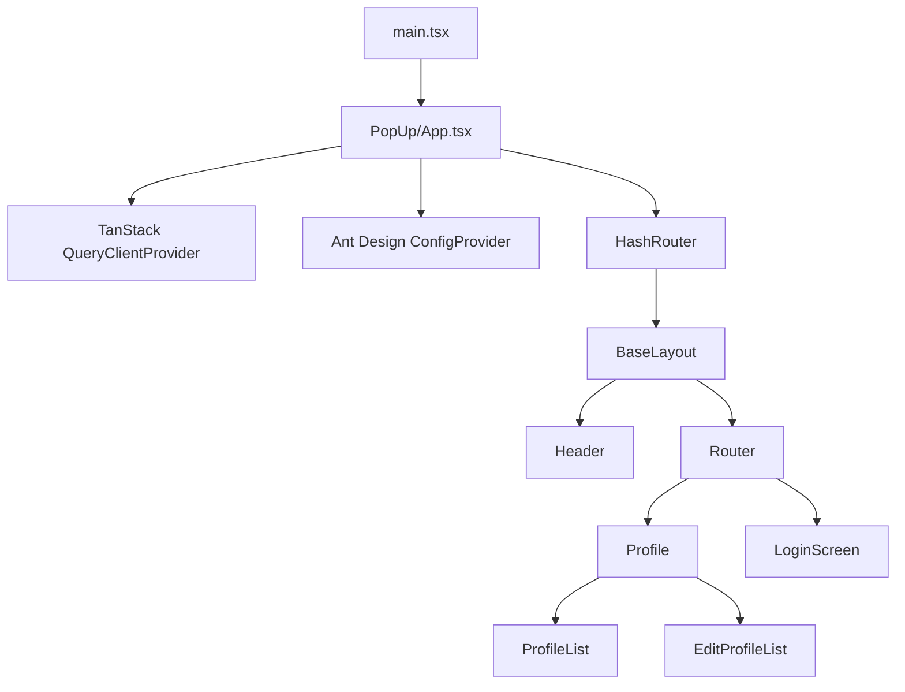

# Navigator Extension Architecture

## System Role

`navigator_extension` is a Manifest V3 Chrome extension. The legacy LinkedIn
scraper, background service worker, and browser-action popup have been removed.
The remaining source is the reusable Talentor popup application, which is being
repurposed for an in-page overlay (iframe) opened by a fixed launcher.

Current runtime:

- **Content script:** `src/modules/injector/index.tsx` runs on every `http(s)`
  page, mounts a shadow-DOM launcher, and opens an extension-origin iframe overlay.
- **Popup application source:** `index.html -> src/main.tsx -> src/modules/popup/App.tsx`.
  It is loaded by the overlay iframe via `chrome.runtime.getURL('index.html')`.
- **No background service worker.**
- **No `action.default_popup`.**

## Build And Manifest Wiring

```text
manifest.config.ts
└── content_scripts -> src/modules/injector/index.tsx   (http://*/*, https://*/*)
└── web_accessible_resources -> index.html, assets/*
    └── launcher + overlay iframe (shadow DOM)

index.html
└── src/main.tsx
    └── src/modules/popup/App.tsx      # loaded inside the overlay iframe
```

CRXJS derives manifest HTML entries from `action`, `options_*`, `sandbox`, etc.,
not from `web_accessible_resources`, so `vite.config.ts` adds `index.html` with
`build.rollupOptions.input.overlay` to get it bundled.

## Source Hierarchy

```text
src/
├── main.tsx                    React entry (mounted by index.html in the iframe)
└── modules/
    ├── common/                 Cross-module: components/, constants/, hooks/, models/, utils/
    │   ├── components/         Generic ButtonIcon
    │   └── models/             Generic types (CustomizableComponent, IconSize, ...)
    ├── injector/               Content script: shadow-DOM launcher + overlay iframe
    │   ├── index.tsx           Content-script entry (manifest js)
    │   ├── App.tsx             Launcher/overlay composition
    │   ├── constants.ts        Extension app URL
    │   ├── injector.css        Tailwind entry + `:host` reset/theme vars
    │   ├── components/         LauncherButton, OverlayPanel, Icons
    │   └── hooks/              useOverlay
    └── popup/                  Application loaded in the overlay iframe
        ├── api/                Axios client, auth, user and profile endpoints
        ├── components/         Reusable visual/form components
        ├── containers/         Header and menu
        ├── constants/          Route paths and session keys
        ├── hoc/                Auth redirect wrapper
        ├── hooks/              Cross-page data hooks (useProfile)
        ├── lang/               i18next setup and translations
        ├── models/             Popup-specific TypeScript contracts
        ├── pages/              Login and profile screens
        ├── routes/             HashRouter route tree
        └── store/              Zustand state and persistence
```

Aliases: `@modules/*` -> `src/modules/*`, `@common/*` -> `src/modules/common/*`,
`@lang/*` -> `src/modules/popup/lang/*`.

`src/Apps/HTMLInjector/`, `src/Apps/ServiceWorker/`, and `src/Apps/constants.ts`
were deleted.

## In-Page Overlay

1. `src/modules/injector/index.tsx` runs on every `http(s)` page (`document_idle`).
2. It appends a single host element, attaches a shadow root, and mounts React.
3. `LauncherButton` (fixed, bottom-right) opens `OverlayPanel`; both the launcher
   and the overlay close control are icon-only `ButtonIcon`s from
   `@common/components`.
4. The launcher is draggable (`useDraggableLauncher`, pointer events): it follows
   the cursor, is clamped to the viewport, and on drop snaps to the nearest
   left/right edge. `{ side, y }` persists in `chrome.storage.local` under
   `launcher-position` (requires the `storage` permission). `App.tsx` owns the
   hook so the panel can reuse the launcher's side/position.
5. `OverlayPanel` renders an iframe whose `src` is
   `chrome.runtime.getURL('index.html')`; the app uses `HashRouter`, so routes
   stay valid inside the frame. The panel opens on the launcher's side, aligned to
   its vertical position, and is clamped (`useViewport` + `EDGE_MARGIN`) so it
   never exceeds the viewport.
6. `index.html` and `assets/*` are listed in `web_accessible_resources`.
7. `injector.css` (`@import 'tailwindcss'` + `:host` reset/theme vars) is imported
   with Vite's `?inline` and appended as a `<style>` tag inside the shadow root,
   so `tai:`-prefixed utilities and preflight apply only to the overlay and never
   to the host page. Injector icons come from `components/Icons` (react-icons/Lucide,
   type-driven `strokeWidth` default `2.7`), mirroring `apps/web`.

## Application Component Hierarchy



## Routes

| Path                  | Screen                                     |
| --------------------- | ------------------------------------------ |
| `/`                   | Redirects to `/profile`.                   |
| `/profile`            | Profile list (`ProfileList`).              |
| `/profile/config`     | Create profile (`EditProfileList`).        |
| `/profile/config/:id` | Edit selected profile (`EditProfileList`). |
| `/auth/login`         | Login screen.                              |

Protected profile routes are wrapped by `RenderAuthComponent`, which redirects
to `/auth/login` when no session token is present. Routing stays hash-based
(`HashRouter`) so it remains valid inside an extension-origin iframe.

## State And Data Flow

| State or layer                 | Storage                      | Responsibility                                                                           |
| ------------------------------ | ---------------------------- | ---------------------------------------------------------------------------------------- |
| `useSessionStore`              | Persisted as `session`       | Authenticated `UserResponse` user and access token. Axios reads the token via the store. |
| `useJobProfile`                | Persisted as `jobProfile`    | Selected profile ID.                                                                     |
| `useJobProfileResumeFormStore` | Persisted as `job-post-form` | Legacy form store; currently unused.                                                     |
| TanStack Query                 | Query cache                  | Remote user data and mutation invalidation (`['USER_INFO']`).                            |
| `localStorage['current-path']` | Browser storage              | Last popup route used by the menu.                                                       |

## Authentication (Login-Only)

1. `LoginScreen` submits `username` and `password` through `loginApi` (`POST /api/v1/auth/login`).
2. The response envelope carries `{ token, user }`. `useLogin` writes both into `useSessionStore` (Zustand `persist`, localStorage key `session`).
3. `user` is the shared `UserResponse` contract from `@talentor/contracts`. The store type extends it with an optional `userJobProfile`.
4. Axios reads the token from the store and sends `Authorization: Bearer <token>`.
5. `RenderAuthComponent` guards protected routes behind `token`; `Menu` renders nothing without a token.
6. A Register link opens `${WEB_URL}/register` in a new tab, where the website handles signup.

Refresh uses an HttpOnly `refresh_token` cookie. Extension refresh-token handling
is out of scope, so an expired access token requires logging in again.

## Backend Contract

| Extension client      | Backend path                           | Use                                                      |
| --------------------- | -------------------------------------- | -------------------------------------------------------- |
| `fetchSession.ts`     | `POST /api/v1/auth/login`              | Login only.                                              |
| `fetchUser.ts`        | `GET /api/v1/user`                     | Load current user (`UserResponse`; no `userJobProfile`). |
| `jobProfileApi.ts`    | `POST`/`PUT /api/v1/user/job-profile`  | Create or update profile.                                |
| `deleteJobProfile.ts` | `DELETE /api/v1/user/job-profile/{id}` | Delete profile (no matching backend endpoint yet).       |

The removed job-apply and resume-history endpoints (`POST /api/v1/jobs/apply`,
`GET /api/v1/resume/history/{profileId}`) are no longer called.
