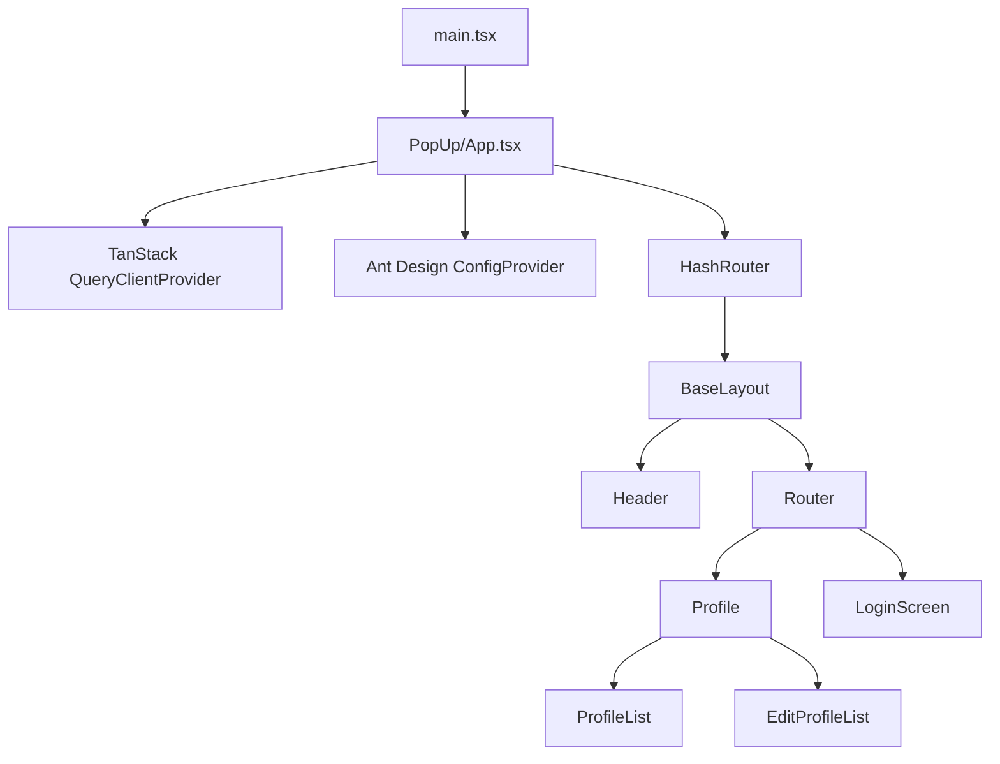

# Navigator Extension Architecture

## System Role

`navigator_extension` is a Manifest V3 Chrome extension. The legacy LinkedIn
scraper, background service worker, and browser-action popup have been removed.
The remaining source is the reusable Talentor popup application, which is being
repurposed for an in-page overlay (iframe) opened by a fixed launcher.

Current runtime:

- **Popup application source:** `index.html -> src/main.tsx -> src/Apps/PopUp/App.tsx`.
  It is retained as the application that the upcoming in-page overlay will load.
- **No content script.**
- **No background service worker.**
- **No `action.default_popup`.**

## Build And Manifest Wiring

```text
manifest.config.ts
└── name / version / icons only
    (no action, no background, no content_scripts)

index.html
└── src/main.tsx
    └── src/Apps/PopUp/App.tsx      # retained application source
```

Because the popup HTML is not yet referenced by the manifest, the production
build currently emits only `manifest.json` and the icons. The next phase will
register the application as a web-accessible resource for the overlay iframe.

## Source Hierarchy

```text
src/
├── main.tsx                    React entry (mounted by index.html)
├── Apps/
│   └── PopUp/
│       ├── api/                Axios client, auth, user and profile endpoints
│       ├── components/         Reusable visual/form components
│       ├── containers/         Header and menu
│       ├── constants/          Route paths and session keys
│       ├── hoc/                Auth redirect wrapper
│       ├── hooks/              Cross-page data hooks (useProfile)
│       ├── lang/               i18next setup and translations
│       ├── models/             TypeScript contracts
│       ├── pages/              Login and profile screens
│       ├── routes/             HashRouter route tree
│       └── store/              Zustand state and persistence
```

`src/Apps/HTMLInjector/`, `src/Apps/ServiceWorker/`, and `src/Apps/constants.ts`
were deleted.

## Application Component Hierarchy



## Routes

| Path                  | Screen                                     |
| --------------------- | ------------------------------------------ |
| `/`                   | Redirects to `/profile`.                   |
| `/profile`            | Profile list (`ProfileList`).              |
| `/profile/config`     | Create profile (`EditProfileList`).        |
| `/profile/config/:id` | Edit selected profile (`EditProfileList`). |
| `/auth/login`         | Login screen.                              |

Protected profile routes are wrapped by `RenderAuthComponent`, which redirects
to `/auth/login` when no session token is present. Routing stays hash-based
(`HashRouter`) so it remains valid inside an extension-origin iframe.

## State And Data Flow

| State or layer                 | Storage                      | Responsibility                                                                           |
| ------------------------------ | ---------------------------- | ---------------------------------------------------------------------------------------- |
| `useSessionStore`              | Persisted as `session`       | Authenticated `UserResponse` user and access token. Axios reads the token via the store. |
| `useJobProfile`                | Persisted as `jobProfile`    | Selected profile ID.                                                                     |
| `useJobProfileResumeFormStore` | Persisted as `job-post-form` | Legacy form store; currently unused.                                                     |
| TanStack Query                 | Query cache                  | Remote user data and mutation invalidation (`['USER_INFO']`).                            |
| `localStorage['current-path']` | Browser storage              | Last popup route used by the menu.                                                       |

## Authentication (Login-Only)

1. `LoginScreen` submits `username` and `password` through `loginApi` (`POST /api/v1/auth/login`).
2. The response envelope carries `{ token, user }`. `useLogin` writes both into `useSessionStore` (Zustand `persist`, localStorage key `session`).
3. `user` is the shared `UserResponse` contract from `@talentor/contracts`. The store type extends it with an optional `userJobProfile`.
4. Axios reads the token from the store and sends `Authorization: Bearer <token>`.
5. `RenderAuthComponent` guards protected routes behind `token`; `Menu` renders nothing without a token.
6. A Register link opens `${WEB_URL}/register` in a new tab, where the website handles signup.

Refresh uses an HttpOnly `refresh_token` cookie. Extension refresh-token handling
is out of scope, so an expired access token requires logging in again.

## Backend Contract

| Extension client      | Backend path                           | Use                                                      |
| --------------------- | -------------------------------------- | -------------------------------------------------------- |
| `fetchSession.ts`     | `POST /api/v1/auth/login`              | Login only.                                              |
| `fetchUser.ts`        | `GET /api/v1/user`                     | Load current user (`UserResponse`; no `userJobProfile`). |
| `jobProfileApi.ts`    | `POST`/`PUT /api/v1/user/job-profile`  | Create or update profile.                                |
| `deleteJobProfile.ts` | `DELETE /api/v1/user/job-profile/{id}` | Delete profile (no matching backend endpoint yet).       |

The removed job-apply and resume-history endpoints (`POST /api/v1/jobs/apply`,
`GET /api/v1/resume/history/{profileId}`) are no longer called.
