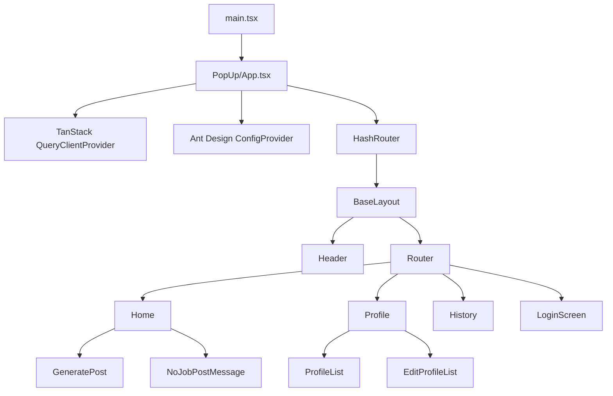
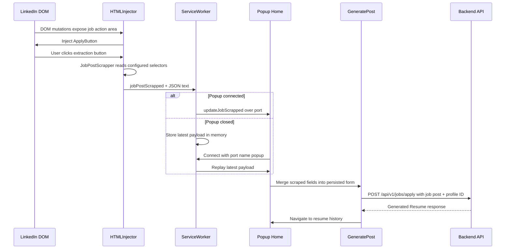

# Navigator Extension Architecture

## System Role

`navigator_extension` is a Manifest V3 Chrome extension. It has three runtime contexts:

1. **Popup:** React application for login-only authentication, profile selection, manual job input, resume generation, and history. Account registration happens on the website.
2. **Content script:** LinkedIn DOM integration. Runs only on `https://www.linkedin.com/jobs/*`, injects the extraction button, and scrapes visible job fields.
3. **Service worker:** Background bridge between content script messages and the open popup port.


## Build And Manifest Wiring

```text
manifest.config.ts
├── action.default_popup -> index.html
│   └── src/main.tsx
│       └── src/Apps/PopUp/App.tsx
├── background.service_worker -> src/Apps/ServiceWorker/index.ts
└── content_scripts
    └── https://www.linkedin.com/jobs/*
        -> src/Apps/HTMLInjector/index.tsx
```

`src/Apps/PopUp/popup.tsx` exists but is not the current manifest entry.

## Source Hierarchy

```text
src/
├── main.tsx                    Popup React entry
├── Apps/
│   ├── constants.ts            Cross-context message names
│   ├── ServiceWorker/          Content-script/popup bridge
│   ├── HTMLInjector/           LinkedIn DOM integration and scraper
│   │   ├── components/         Injected button
│   │   ├── helpers/             Scraping logic
│   │   └── constants.ts         LinkedIn selectors and scraped fields
│   └── PopUp/
│       ├── api/                Axios clients and endpoint constants
│       ├── components/         Reusable visual/form components
│       ├── containers/          Header, menu, information layout
│       ├── constants/           Routes and session keys
│       ├── hoc/                Auth redirect wrapper
│       ├── hooks/              Cross-page data hooks
│       ├── helpers/            Form/data utilities
│       ├── lang/               i18next setup and translations
│       ├── models/             TypeScript contracts
│       ├── pages/               Login, home, profile, history screens
│       ├── routes/              HashRouter route tree
│       └── store/              Zustand state and persistence
```

## Popup Component Hierarchy



`Home` owns the popup port connection. When a scrape message arrives, it parses the JSON and merges fields into `useJobPostFormStore`.

## Scrape-to-Resume Sequence



The confirmation action is defined in the protocol. The popup sends it with `port.postMessage`, while the worker listens for it through `chrome.runtime.onMessage`; current confirmation clearing is therefore unreliable.

## State And Data Flow

| State or layer                 | Storage                      | Responsibility                                                                           |
| ------------------------------ | ---------------------------- | ---------------------------------------------------------------------------------------- |
| `useSessionStore`              | Persisted as `session`       | Authenticated `UserResponse` user and access token. Axios reads the token via the store. |
| `useJobProfile`                | Persisted as `jobProfile`    | Selected profile ID for generation and history.                                          |
| `useJobPostFormStore`          | Persisted as `job-post-form` | Scraped/manual job-post fields.                                                          |
| `useJobProfileResumeFormStore` | Also `job-post-form`         | Separate form store; key collision risk.                                                 |
| `useHistoryStore`              | Memory only                  | Optional local resume list state.                                                        |
| TanStack Query                 | Query cache                  | Remote user/history data and mutation invalidation.                                      |
| `localStorage['current-path']` | Browser storage              | Last popup route used by menu.                                                           |

## Authentication (Login-Only)

The popup only authenticates; it does not register accounts.

1. `LoginScreen` submits `username` and `password` through `loginApi` (`POST /api/v1/auth/login`).
2. The response envelope carries `{ token, user }`. `useLogin` writes both into `useSessionStore` (Zustand `persist`, localStorage key `session`).
3. `user` is the shared `UserResponse` contract from `@talentor/contracts` (`{ id, email, username, accountVerified, role, createdAt, updatedAt }`). The store type extends it with an optional `userJobProfile` for extension-specific use.
4. Axios reads the token from the store on each request and sends `Authorization: Bearer <token>`.
5. `RenderAuthComponent` guards protected routes behind `token`; `Menu` renders nothing without a token.
6. A Register link on `LoginScreen` opens `${WEB_URL}/register` in a new tab, where the website handles signup. `WEB_URL` is `import.meta.env.VITE_WEB_URL` (default `http://localhost:5173`).

The backend still exposes `POST /api/v1/auth/register`, but the extension no longer calls it.

Refresh uses an HttpOnly `refresh_token` cookie. Extension refresh-token handling is out of scope, so an expired access token requires logging in again. CORS for the extension origin is backend work not present in this repository.

## Backend Contract

| Extension client  | Backend path                             | Use                                                      |
| ----------------- | ---------------------------------------- | -------------------------------------------------------- |
| `fetchSession.ts` | `POST /api/v1/auth/login`                | Login only.                                              |
| `fetchUser.ts`    | `GET /api/v1/user`                       | Load current user (`UserResponse`; no `userJobProfile`). |
| Profile API       | `POST`/`PUT /api/v1/user/job-profile`    | Create or update profile.                                |
| `resumeApi.ts`    | `POST /api/v1/jobs/apply`                | Generate and persist resume.                             |
| `resumeApi.ts`    | `GET /api/v1/resume/history/{profileId}` | Load history.                                            |

Declared extension paths for profile deletion and resume download do not currently have matching backend endpoints.
